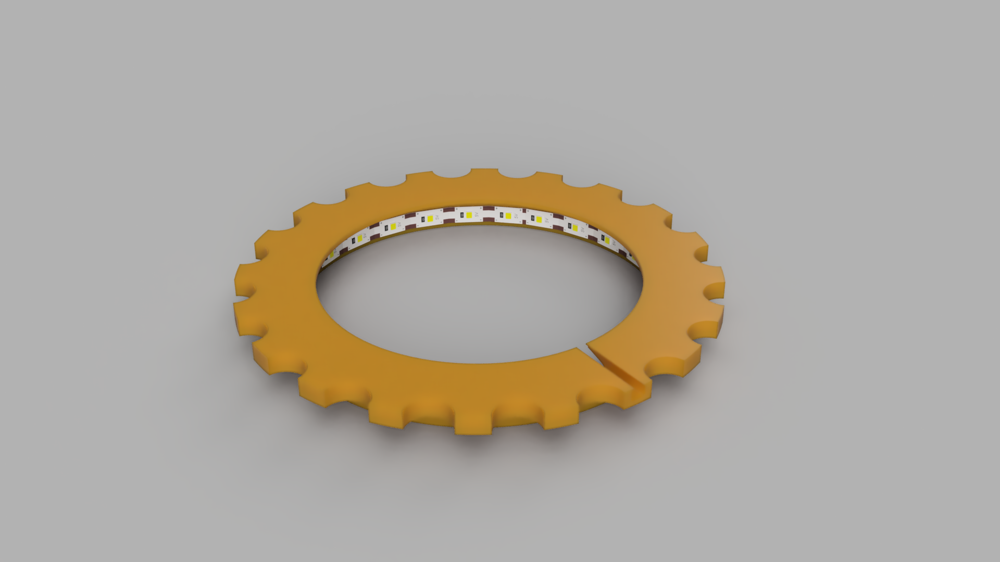
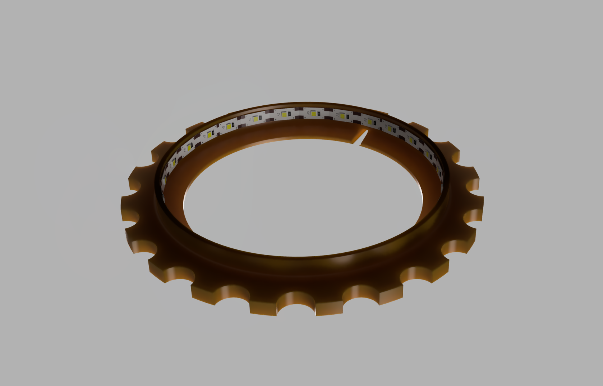
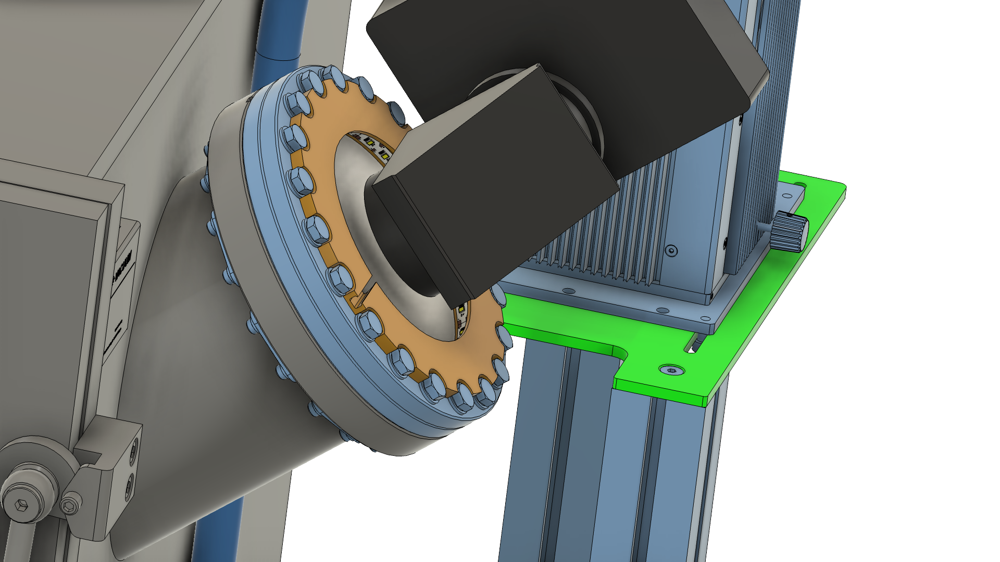

# DN160CF LED Ring
CAD files for a DN160CF vacuum flange LED ring to illuminate the inside of a vacuum chamber. Low-cost alternative to expensive commercial products.
3D Printed with PLA, LED strip can be glued. Additionally, reflective tape on the inside part of the ring can improve the performance.

(c) 2025 Space Research & Planetary Science Division, University of Bern, Bern, Switzerland.
